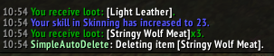

# SimpleAutoDelete

## What is it

SimpleAutoDelete is a lightweight and minimal list based addon for Wow Wotlk 3.3.5a to automatically delete unwanted items.

## How to install

Go to Releases in https://github.com/nullfoxh/SimpleAutoDelete-WOTLK/releases and download SimpleAutoDelete.zip. Extract it to your World of Warcraft/Interface/AddOns folder and you're done!
The final path should be World of Warcraft/Interface/AddOns/SimpleAutoDelete/SimpleAutoDelete.toc.

## How does it work

SimpleAutoDelete will run once the loot window closes after the configured delay, which is 0.4 seconds by default.
If the player is in combat, SimpleAutoDelete will wait until the combat ends. SimpleAutoDelete will then look for and remove any items in the players inventory that have been added to its deletion list.

## How to configure

Access the addon's functionality by typing the following commands in the game chat:

* `/sad add <item name or link>`: Adds an item to the deletion list. Replace `<item name or link>` with the item's name or link.
* `/sad remove <item name or link>`: Removes an item from the deletion list. Replace `<item name or link>` with the item's name or link.
* `/sad list`: Lists all items in the deletion list.
* `/sad delay <seconds>`: Sets the delay time in seconds for deletion.
* `/sad print <true/false>`: Toggles printing of items being deleted. Replace `<true/false>` with "true" or "false".
* `/sad test`: Lists all items in your bags that would be deleted based on the current deletion list.
* `/sad run`: Scans your bags immediately for items to delete and deletes them.

**Note:** Remember to be absolutely certain about the items you're adding to the deletion list.
